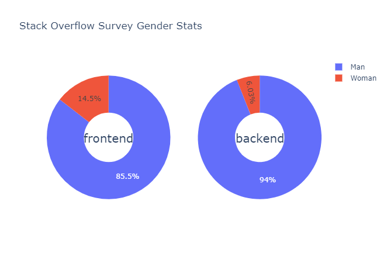
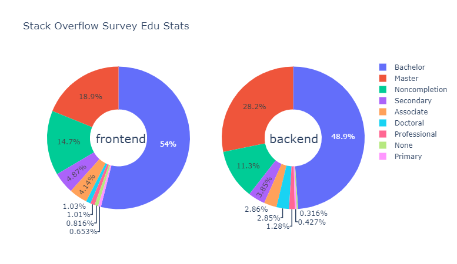

# 从Stack Overflow Survey数据看开发者的“技术茧房”

## 引言

Stack Overflow是一个面向专业和编程爱好者的问答网站，几乎每一个开发者或者是正在学习开发技术的学生，都曾经受惠于它高质量的问答。


Stack Overflow Survey是该网站一年一度的开发者调查，收集当年开发者的基本信息以及技术偏好等。由于平台本身的知名度，以及调查往往受到很多开发者的关注，在开发者社区上有一定的讨论热度。


## 数据集

官方[开放](https://insights.stackoverflow.com/survey)这个调查所有的数据结果，这为我们数据科学的学习者提供了机会。

基于时效性的考量，本项目选取了Stack Overflow Survey 2020和2021的数据；但同时了解到这两份数据在COVID-19爆发前后收集，所以2021年的数据集可能同先前的技术变化的范式有细微的不同，所以我们着重在2020年的数据集上进行分析。

近两年的调查大约60个问题，包含和开发者相关的各方面的问题，包括基本信息、教育和职业经历、技术使用和技术偏好以及同平台本身有关的反馈等，基于此，能够提出很多有价值的问题。

另外，我们爬取了Reddit上关于这个调查的所有讨论的文本数据，试图借此指导方向、辅证研究。


## 问题界定

由于官方会针对数据做出完整的展示，且数据分析者较多，可以说“前人之述备矣”。为了更进一步地了解这些数据，我们在各个开发者社区上搜索相关内容，试图发掘有意义的问题。

在Reddit上，一条评论启发了我们：


在官方去年的结果中，开发工具的统计中竟有将近30%的人在使用Notepad++写代码。这不仅引发了网友的讨论，也使我感到非常困惑。我也正受到着已有开发经验的束缚，而失去了对整体开发群体的客观认识。

在信息管理相关领域的研究者中，“信息茧房”是一个不陌生的名词。上述的情况似乎正是一个关于技术偏好的“茧房”。

信息茧房是兴趣引导的结果，最终导致思想和认识的狭限。而我们借助计算机编程，往往处理自己一类的任务，并基于已有的技术不断进行实践，使我们更加不愿意轻易更换现有工具套件，这样就可能会造成我们所说的“技术茧房”。

当然，技术和认知是有着本质上的不同的，我们通常认为信息茧房是不好的，但编程作为工具，往往只需要“一招鲜”，毕竟目的重于手段。所以这更应当被中性地称为”墙“，既是狭限也是壁垒。同时由于我们的结果表明，技术栈可以通过语言作为代表进行研究，所以我们可以将这种现象称为”语言墙”。

但如果要成为一个好的开发者或者研究者，就需要对相关领域的技术有开阔的眼界，此时，上述的问题将会成为阻碍进步的因素。比如，在项目中，我们就难以利用python绘制出（课程群里分享过的）那样匀称、反映流入流出的arcplot图。


我们试图通过数据研究的方法，来认识这个“技术茧房”/“语言墙”：

- 开发者根据技术的不同，能不能找到一些普遍性的特征？比如年龄、受教育程度等等
- 开发者的技术偏好是否存在典型的分类？我们提到的“技术茧房”有没有形成的条件？
- 哪些开发者的技术偏好之间集聚性更强？谁更有需要提防这种现象？

基于此，我们可以那些试图为有意拓宽自己技术视野的开发和学习者提供一些建议，这个人群应当是可观的。

## 问题研究

### 认识问题

我们谈及的技术偏好，暂时非常抽象。那么如何入手研究一个普遍又具体的结论呢？

我们不妨来看看开发者们的讨论，哪些是大家关注的技术方向，然后对其进行着重研究。一方面可以提供精确的目标，另一方面，较高的热度意味着较多的数据，有利于后续开展研究。

我们编写了一个爬虫，收集了reddit下Stack Overflow Survey相关的搜索结果的评论，共收集12700条评论，共计35165行。

有关爬虫的开发，因为Reddit是一个对开发者非常友好的社区，在反爬方面设限极小，在github上还有相关的开源爬虫框架，所以项目中的爬虫得以非常容易地开展。

项目中的爬虫主要分为如下两个步骤：

1. 利用selenium，编写一个半自动的问题筛选工具。将对应搜索结果下的问题列表进行人工筛选，随后一键导出链接列表。
2. 基于reddit爬虫框架praw进行快速的爬虫原型实现，遍历上述得到的所有链接，得到文本内容。

注意，项目中爬虫使用的APP id是开发者自有的，提交的代码包中的相关代码使用的这个APP可能在后续会被删除，不一定保证能运行复现。如果提示该APP删除不能正常运行，请在按照官方文档：https://praw.readthedocs.io/en/stable/getting_started/authentication.html进行APP申请和鉴权配置。

完成语料收集之后，具体的分析工作分为如下几步：

1. 导入英语常用停用词库；
2. 对原始语料进行朴素分词，粗略得出词频分析；
3. 将数据集中技术相关的标签统计生成词表，并建立大小写、多项标签的同义词表
4. 人工查找对比2中的词频结果与3中的词表，将词频高于40的技术相关词添加到词表，并重新建立同义词表。
5. 基于上述的词表和同义词，利用nltk对原始语料进行分词，得出最终结果。


对上述的词云，我们有如下观察：

1. Linux(1228)和Windows(953)相关的讨论非常多。
2. 除此之外全为各种语言，排在前列的包括：Rust(1642), Java(1070), Go(945), C(938), Python(798), C++(637), JavaScript(408)。

基于此我们对开发平台和语言做重点研究，语言是重中之重。

另外可以看到这些讨论比较多的语言，除Javascript之外，都是后端语言，这是令人疑惑的，因为在数据准备和完全的描述性统计的工作中，我们发现，前端程序员群体和后端程序员群体，在数量上并不会有如此巨大的差异。因此我们猜想，前后端程序员之间可能存在着一些差异，讨论热度可能表征着群体内部的标准之间争论的热度，那么前端程序员的技术栈在一致性和集聚性上会更强一些。与之相比，后端之间存在着技术壁垒，这些壁垒创造出大量的讨论。


**结论1** 技术偏好的研究是语言和平台偏好的研究。

**猜想1** 讨论越少说明技术偏好的一致性更高。

**猜想2** 前端程序员的技术偏好一致性和集聚性更强。

### 聚类分析

我们从平台和语言的两个大方向上，做聚类分析，看看是否有比较显著的类，他们有着一些明显的特点。在最理想的情况之下，这个分析可以解决我们的问题了。

完成kmeans聚类的大致操作步骤如下：

1. 将技术偏好相关的列表进行explode操作，进行初步编码
2. 对数据进行白化处理
3. 利用肘部法则找出合适的k值，并进行聚类
4. 按照聚类结果对记录进行二次编码，并利用TSNE进行数据降维
5. 绘制结果

我们绘制了平台和语言两类相关指标的聚类结果，如下：


之前的分析结果中，平台之争主要是Windows和Linux之争，但直觉上，用windows还是linux其实也并不是决定程序员分类的一个好指标，毕竟从前端到后端、新手或是老手，都有可能使用有着良好图形界面的Windows，亦或是专注开发的Linux。

相比之下，语言的结果就相对分明，尽管其中蓝色和紫色两类仍然混杂，但至少进一步说明了：

**结论2** 语言对于程序员技术群体分类的代表性作用是更强的。

### 从关联规则看聚集程度

基于之前的讨论，其实我们已经可以将分析的重点放在语言上了。但是为了严谨，这里我们还是做出了全部的情况，在研究聚集性的同时来辅证“语言重点论”（结论2）。

这里使用Apriori进行关联规则挖掘，随后使用PyARMViz进行可视化操作。

在平台的关联规则可视化中，关键项集包括MacOS、Linux、AWS和Docker，而和Windows无关。


上述几项都是后端开发工程师常用平台，而前端和全栈工程师往往会采用Windows更多，联系之前基于平台数据的聚类效果，我们认为，平台数据或许可能只能将后端程序员较好地分别出来，所以得到了不太好的聚类结果。

另外几个比较显然且简明的关联规则如下：

1. 协作平台：GitHub和slack本身是合作的，所以有较强的关联。
2. 数据库：MySQL在数量上占有绝对优势，所以有指向其他各项的较高lift的关联规则。

接下来是一些关于语言的有价值的结果：

我们做出web框架和语言的关联规则可视化如下：


web框架中，关联关系最强的是asp.net和asp.net core，这是一个很有意思的结果，同一个技术栈的程序员即便更新换代仍然会留在原技术栈中。与此相对应的是react.js和express之间同属于JavaScript技术栈。（jquery作为早期基建，影响了一代前端技术，所以同较早的angular和asp.net都有关联，并不能贡献非常有价值的关联性结论。）这证明了我们的前端技术栈一致性的猜想。前端的技术一致性还可以从语言使用的强关联中看出来。语言强关联规则几乎全为前端相关语言，连同SQL构成现在庞大的web前端和全栈程序员的技术栈集合。

为了看看后端的情况（我们简单地将含有JavaScript的记录滤掉），单独来观察后端程序员的情况。但输出关联规则为空，说明后端各语言技术栈之间无强关联，也即后端程序员没有同时形成一套稳定的多种语言的工作组合。这和我们先前作文本分析得到的（从后端论战更为严重看出的）后端壁垒更为严重的猜想相符。

**结论3**（验证猜想2） 前端技术栈一致性更强，而后端技术栈壁垒更加严重。


### 技术栈之间的流动

我们在上一个部分中得到了一些关于后端技术存在壁垒的观察。我们这里看看后端技术栈之间是否因为这种各自为政而导致流动性下降。

虽然在关联规则中，我们发现语言和web框架的选择都有代表性。但结合在文本分析和聚类分析中分析的经验，大家都以语言来代表技术阵营进行讨论，同时语言的代表性足够好，这里我们只展示语言的流向可视化。

这里我们采用了两种方式进行这样的工作：
1. 第一种，将每条记录权重设为1，均分到其预期的各个语言上，这种方法将一人多投带来的影响归一化了。
2. 第二种，将一个程序员当前实际在用的技术到预期使用的技术绘制为整个技术流向网络中的一条有向边，如果这条边存在，则为其增加边权，统计每个节点的入度（被预期的那些）和出度之和，这个方法的好处在于，可以兼顾到一些不一定能使用，但确实在舆论上受支持的语言，也就能从另一个侧面反映出舆论趋势的变化。这些语言往往是新兴语言比如rust。

方法一，我们首先通过网络分析做出流向图：

1. 将LanguageWorkedWith和LanguageDesireNextYear进行split操作，截断为语言列表，简记为now和desire
2. 将一个开发者记录的now的总权值设为1，并均分到desire上。
3. 计算节点总权值，经过处理后设定为图节点的大小。
4. 绘图。


做出各个自环的权重，结果如下：


其中除Go和PHP以外并没有典型的web后端语言，遥遥领先的HTML/CSS和JS、TS套件，又再次说明前端技术栈的强一致性。

另外，这里还有一个主线并无关系但有趣的结果，即新手程序员入门的语言选择：

```
new_bird Java {'weight': 0.6428571428571428}
new_bird JavaScript {'weight': 0.6428571428571428}
new_bird Python {'weight': 0.47619047619047616}
new_bird SQL {'weight': 0.47619047619047616}
new_bird R {'weight': 0.3333333333333333}
new_bird C {'weight': 0.14285714285714285}
new_bird C++ {'weight': 0.14285714285714285}
new_bird HTML/CSS {'weight': 0.14285714285714285}
```

方法2，我们利用桑基图来进行进行可视化。利用基于pyecharts的动态桑基图，我们能够较为清晰地说明流量关系。

我们将一个程序员`当前实际在用的技术`到`预期使用的技术`绘制为整个技术流向网络中的一条有向边，如果这条边存在，则为其增加边权，统计每个节点的入度（被预期的那些）和出度之和，也就能从另一个侧面反映出舆论趋势的变化。


在这个分析中，入度大于出度的那些节点对应的语言有着更高的舆论趋势。从上面的结果中我们可以看出，有较为明显趋势的语言如下：

1. 扩大：Python（1/4希望留用），TypeScript，还有本年度不在热门列的Rust、Go和Kotlin。

2. 缩小：Java（1/6希望留用）转向Python、Javascript、Go等，C（几乎消亡）

有趣的是，上述七种语言，除TypeScript和Kotlin之外的其余五种有一些共性：

1. 在文本分析部分中，词频都高于JavaScript

2. 都是典型的后端语言。

在上个部分中已经提到，前端界技术认知具有一致性，所以TypeScript没有产生较多的讨论。与之鲜明对比的是后端，后端技术的更迭往往伴随着大量的讨论。这或许在一定程度上说明了我们所设想的“后端技术壁垒”，这是各个语言社区之间莫衷一是的结果。

但从这个结果中，我们发现后端技术栈虽然有着一些舆论和使用上的壁垒，但是却丝毫没有减少流动性，从后端到前端、后端语言之间的流动也都非常明显。这或许说明大家对自己的技术栈也并没有前端那样的信心。这从另一个侧面说明了前端技术栈的强一致性。

这里有如下三条说明：
> 1. Kotlin是Android端平台上替代Java的下一代开发语言，严格来讲不能归于前后端中的一方。但Kotlin的例子和可以用猜想1解释（前后端的区别与猜想1相符）：
> 2. 关于技术的认知是否一致，与社区中讨论的热度有关联。所以当社区形成稳定的最优实践的时候要注意，社区的活跃度可能也就不存在了。我们不妨将猜想1称为编程语言社区的“热度原理”，大家对一项技术的认知越一致，产生的讨论越少。
> 3. 当然我们必须说明的是，这个部分基于可视化而作，略显感性，是对我们结论的一个辅证。

上述只完成了舆论趋势的展示，我们要看看实际上大家在使用技术方面变动有没有如此巨大。之前我们做了大家用手投票（网络分析的舆论趋势）和用嘴投票（文本分析的讨论热点）上的几个点，这里用大家“用脚投票”的结果进行检验：


Python、TypeScript、Go、Rust、Kotlin使用人数确实有着显著的增长，Java也确实下降了，说明大家的技术认识总能朝着一个相对先进的方向前进。

如果我们认为讨论热度和广大开发者的个人选择代表着先进生产力方向的方向的话，那我们还可以得出：

**结论4** 技术演进本身不受到技术特性之外的影响。

这里有一些典型的例子，最为典型的就是Fuchsia OS，但在总体上看，是令人欣慰的。

令人感到疑惑的的是，C语言预期使用的人不多，但使用人群并没有大量的下降。但这应当和我们研究的问题没有严格的逻辑关系，C语言这样的底层语言有其不可替代性，所以有一个稳定的使用人群。但C语言在一致性和热度上面的表现，和我们猜想的“热度原理”是相符的，因为集体或者个人来说都很难形成最优实践，所以始终有着讨论的热度。

### 一般画像

我们在早期就尝试进行全体数据的探索性分析，试图得到一些数据特征能说明哪些程序员更容易出现技术集聚性。但由于技术聚集性这个概念本身并不好量化，而经过上述分析我们发现，前后端的差异引发了技术集聚性的差异，我们接下来就简单地以前后端中几个指标的差异作一补充说明。

年龄分布对比可以看出前端程序员更年轻：


从代码年龄上也可以看出端倪，前端程序员相对代码时间更短：


上述两点都反映前端开发有更多入门者/年轻人。

我们还可以从性别和教育程度来观察这个问题：



观察后端中女性相对更少。这个问题是复杂的社会学结果，为了避免不必要的争论，不再赘述。



观察拥有硕士学位和学士学位的人群占比，后端高于前端。这也说明准入门槛较低。

综上四项以及我们对于前后端差异的对比，我们认为：

**结论5** 技术栈一致性、最优实践和准入门槛之间有着关联，但在我们的项目中，无法说明形成这三者之间的因果关系。

这是一个循环，入行人越多就更有机会进行大量实践并形成最优实践，有最优实践之后，进一步推进技术栈的一致性，并使得行业培训难度降低，准入门槛降低，进一步吸纳更多新人。


## 结论

基于数据集和语料分析，我们得出如下结论：

- **结论1** 技术偏好的研究是语言和平台偏好的研究。
- **结论2** 语言对于程序员技术群体分类的代表性作用是更强的。
- **结论3**（验证猜想2） 前端技术栈一致性更强，而后端技术栈壁垒更加严重。也即我们称为“技术壁垒”或者更具体地称为“语言墙”的现象。对于前者表现为全体技术栈的统一化，称为狭限；后者表现为迁移困难、无相对最优实践带来的讨论和消耗，称为壁垒。这比我们预期的现象更加复杂，内涵更为丰富，因而也可以为更多的人提供建议。
- **结论4** 如果认为广大开发者的个人选择意味着先进生产力方向，那么技术演进本身不受到技术特性之外的影响。
- **结论5** 前端开发者中入门者普遍更多，这或许和技术栈的一致性有关系。但其间的因果性我们无法说明。

还有一条在分析过程中反复验证的经验规律，我们称之为**热度原理**的：大家对一个技术栈的认知越一致，产生的讨论越少。


因此我们可以提出一些建议：

1. 当学习的语言有着活跃的语言社区的时候，说明语言正处于最优实践还未形成的时候，如果想要以此入门，并不是一个好选择。比如Python是一个好选择而Rust不是。
2. “语言墙”存在于两个主要的技术门类当中：
   1. 诸如前端等形成了最优实践的技术栈，要意识到，虽然大家对技术栈有着普遍一致的意识，但其门槛较低，自己的技术壁垒很难形成，作为学习者要利用好现有的成果，并居安思危。
   2. 后端技术栈不容易掌握是普遍现象，且各个子技术栈之间的经验流通更加困难。所以如果想入门后端技术，可以底层语言比如C语言，熟悉后端基本知识之后，再选定一些活跃的社区，参与构建关于自己和社区的最优实践并不断进步。

## 不足和展望

主要的不足有如下两点：

- 项目中的开发者标签和各种技术标签都是多选，另外还有很多字段为描述性的文字，要构建多对多的相关关系非常困难，所以在项目中我们没有找到一些关于技术集聚性较强的人群更一般的特征，只是大体分为关于技术认知的一致性强或弱的两类，而后对这两类分别作统计，不能详细说明这些描述性统计结果和类之间的因果关系。
- 项目中的结论是带有大量的先验知识的解释，尽管结论本身不是预先设定好的，但我们对于语言的认识必然是局限的，只能尽量做到客观。

展望：

1. 由于前、后端开发工程师占开发者大多数，所以一些人数较少的群体的结论可能本应更显著但被隐藏了。比如我们可以对数据科学工作者的常用语言和技术栈进行案例研究，给数据科学学习者提供一些更加具体的建议，但基于上述5个结论以及我们得到的经验规律，完成这些工作应该不太困难。
2. Stack Overflow开源了从2011年至2021年的全部数据，可以在时间尺度上做更多关于技术演进的研究。

